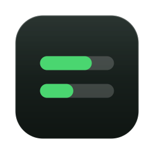
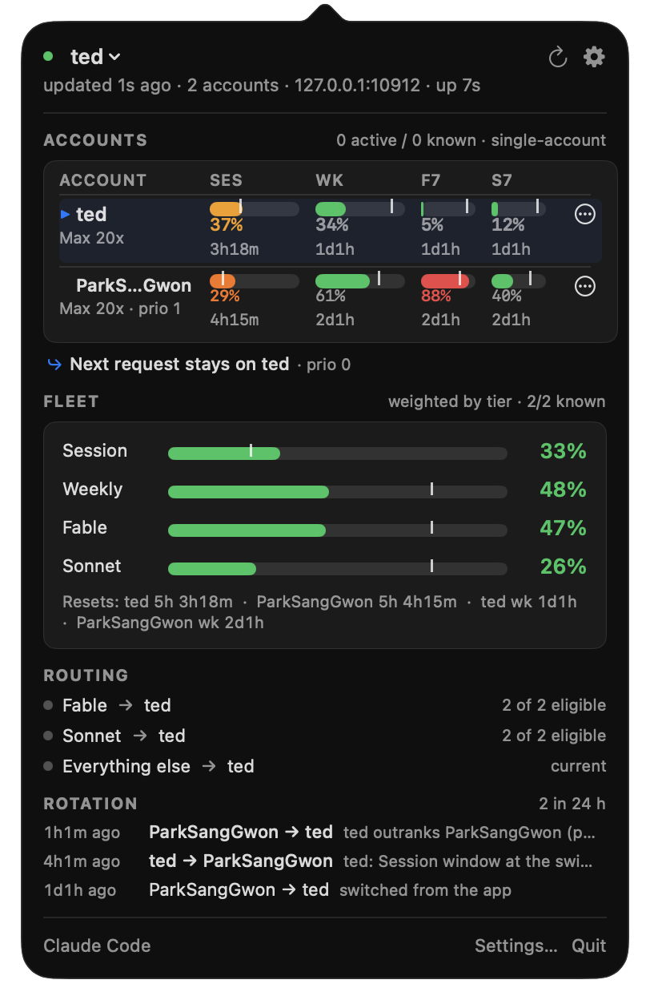
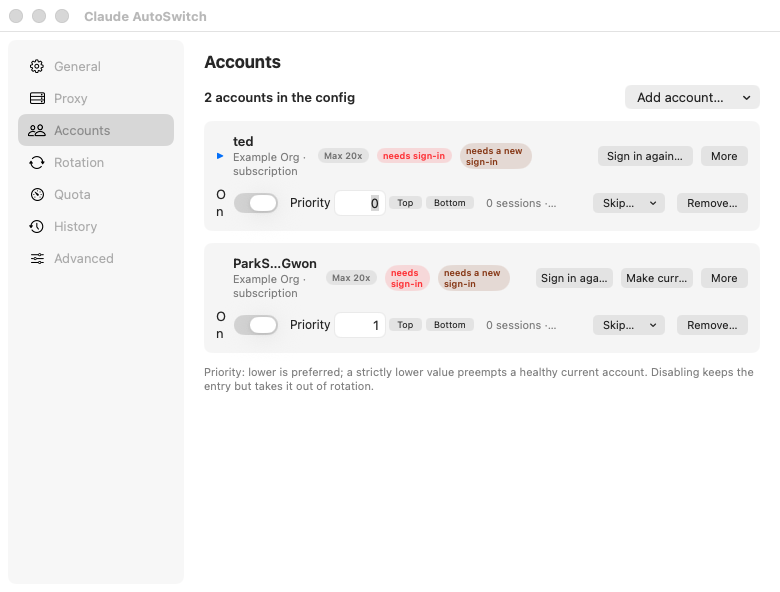
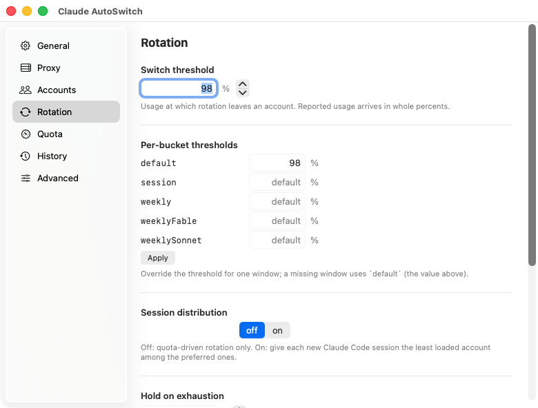
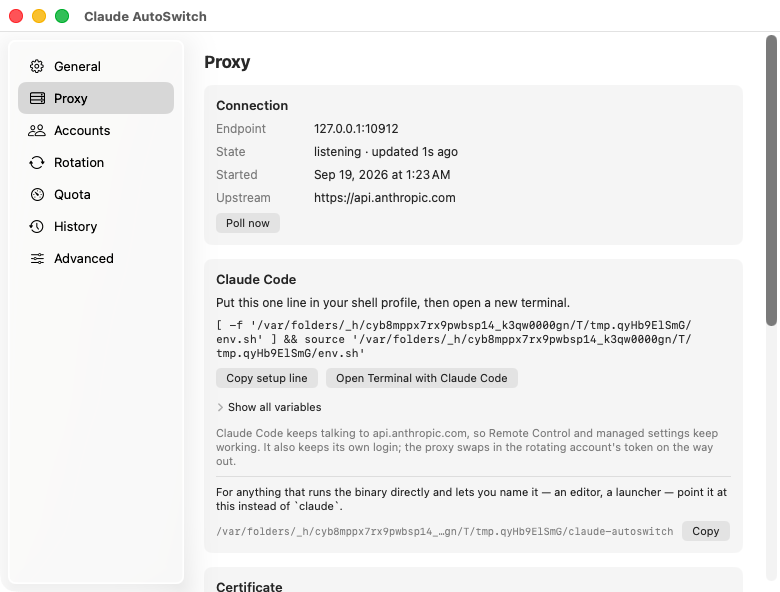
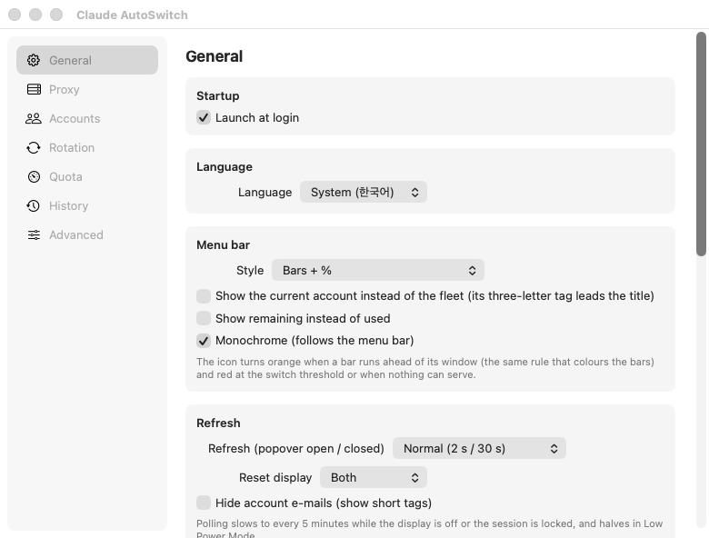

<p align="center">
  
</p>
<h1 align="center">Claude AutoSwitch</h1>
<p align="center">
  여러 개의 Claude 구독, 하나의 Claude Code. 한도가 차오르면 계정을 자동으로 로테이션하고,<br>
  모든 계정의 할당량을 한눈에 보여 주는 메뉴 막대 앱입니다.
</p>
<p align="center">
  
  
  
  
  <a href="LICENSE"></a>
</p>
<p align="center" data-readme-switcher>
  <a href="README.md">English</a> · 한국어 · <a href="README.ja.md">日本語</a> · <a href="README.zh-CN.md">简体中文</a> · <a href="README.de.md">Deutsch</a> · <a href="README.es.md">Español</a> · <a href="README.fr.md">Français</a>
</p>

<p align="center">
  
</p>
<p align="center">
  
</p>

## 문제

**$200 Max 플랜 하나로는 이제 부족하니, 두 개, 세 개를 구독하게 됩니다.**<br>
안에서 들여다보면 이런 모습입니다.

#### Max 플랜 두 개를 쓰는 프리랜서

> "매일 오후면 똑같은 한 줄이 떠요: `You've hit your usage limit · resets at 4pm`.<br>
> 브라우저 열고, 로그아웃하고, 로그인하고, 터미널로 돌아와서, 어디까지 했더라 찾고요."

하루에 두세 번, 한 번에 5분씩.<br>
한 달이면 반나절이 사라집니다.

#### 계정 전환기를 설치한 사람

> "클릭 한 번은 아껴 줘요. 언제 클릭해야 하는지는 안 알려 주고요.<br>
> 여전히 한도를 지켜보다가 손으로 넘겨요."

#### 로테이션 TUI를 돌리는 사람

> "전환은 이제 알아서 돼요. 얼마나 남았는지 보는 건 아니고요.<br>
> 실제로 작업하는 터미널 옆에 터미널을 하나 더 열고 명령을 하나 더 쳐야 해요."

**"그냥…"**

- **…계정 두 개를 쓰면 안 되나요?** 됩니다. 한도에 닿을 때마다 사용자가 직접 전환기가 될 뿐입니다.
- **…전환기 앱을 설치하면요?** 전환이 클릭 한 번으로 줄어듭니다. 언제, 어느 계정으로 넘길지 아는 것은 여전히 사용자 몫입니다.
- **…로테이션해 주는 TUI를 쓰면요?** 로테이션은 해 줍니다. 사용량은 계속 열어 둬야 하는 터미널 안에 있습니다.

**익숙한 이야기인가요?**

- [ ] Max 플랜을 두 개 이상 결제하고 있다.
- [ ] 한도 메시지가 뜨면 곧장 브라우저로 간다.
- [ ] 이 터미널이 어느 계정인지 가끔 잊어버린다.
- [ ] 얼마나 남았는지 보려고 터미널을 연다.
- [ ] 주간 한도는 매번 예고 없이 닥친다.

세 개 이상 해당된다면, 다음 섹션은 당신을 위한 것입니다.

## 해결책

Claude AutoSwitch는 메뉴 막대가 달린 로컬 프록시입니다.<br>
두 개 이상의 Claude 계정으로 로그인하고 Claude Code 앞에 프록시를 둡니다.<br>
모든 요청은 아직 여유가 있는 계정의 토큰으로 나갑니다.<br>
한 계정이 5시간 또는 주간 한도에 도달하면 다음 요청은 그냥 다른 계정을 씁니다.<br>
Claude Code는 로그아웃되지도, 재시작되지도, 알아채지도 않습니다.<br>
Claude Code가 읽는 한도는 계정 하나가 아니라 로테이션 전체의 한도라서, 다른 계정에 여유가 남아 있는 동안에는 한도 안내가 뜨지 않습니다.<br>
모든 계정의 할당량이 메뉴 막대에 있으니, 확인하려고 터미널을 열 일이 없습니다.

계정 *전환기*가 아닙니다: 키체인에서 아무것도 바꿔치기하지 않고 어떤 세션도 끊기지 않습니다.<br>
로테이션은 한도에 닿기 전에 요청 단위로 일어나며, 여러 터미널이 동시에 서로 다른 계정을 쓸 수 있습니다.

## 설치

요구 사항: macOS 14 Sonoma 이상과 Claude Code.<br>
Node도, npm 패키지도, 별도 프록시도 설치할 필요가 없습니다.

### Homebrew

```sh
brew install --cask ParkSangGwon/tap/claude-autoswitch
```

설치 후 macOS가 앱을 열어 주지 않으면 격리 플래그를 지웁니다: `xattr -dr com.apple.quarantine "/Applications/Claude AutoSwitch.app"` (아래의 그래도 열기도 됩니다).

### GitHub 릴리스

[최신 릴리스](https://github.com/ParkSangGwon/claude-account-autoswitch/releases/latest)에서 `Claude-AutoSwitch-vX.Y.Z.zip`을 내려받습니다.<br>
압축을 풀고 **Claude AutoSwitch.app**을 `/Applications`로 끌어다 놓습니다.

### 소스에서 빌드

```sh
git clone https://github.com/ParkSangGwon/claude-account-autoswitch
cd claude-account-autoswitch
make install          # builds dist/Claude AutoSwitch.app and copies it to /Applications
```

앱은 ad-hoc 서명만 되어 있고 공증(notarize)되지 않았습니다.<br>
첫 실행 시 macOS가 개발자를 확인할 수 없다고 할 수 있습니다.<br>
**시스템 설정 → 개인정보 보호 및 보안**을 열고 **그래도 열기**를 클릭하거나, 앱을 오른쪽 클릭 → **열기**를 선택하세요.

## 세 단계로 설정

1. **계정 추가.** 설정 → 계정 → *계정 추가…*
   - 브라우저로 로그인합니다.
   - 브라우저가 이 Mac에 접근할 수 없을 때는 코드를 붙여 넣습니다.
   - Claude Code에 이미 있는 로그인을 가져옵니다(키체인).
2. **Claude Code 앞에 프록시를 둡니다.** 설정 → 프록시 아래에 복사 버튼과 함께 표시되는 한 줄입니다:
   ```sh
   [ -f "$HOME/Library/Application Support/Claude AutoSwitch/env.sh" ] && source "$HOME/Library/Application Support/Claude AutoSwitch/env.sh"
   ```
   셸 프로필에 넣거나 *터미널에서 Claude Code 열기*를 사용하세요.
   바이너리를 직접 실행하는 에디터나 런처에서는 `claude` 대신 같은 폴더의 `claude-autoswitch`를 가리키세요.
3. **로그인 시 실행을 켭니다** (설정 → 일반). Claude Code가 있는 곳에 프록시도 항상 있도록.

설정은 이것이 전부입니다.<br>
Claude Code는 자기 로그인을 그대로 유지하고, 계속 `api.anthropic.com`과 통신하므로 Remote Control·관리 설정·조직 정책이 그대로 동작합니다.<br>
프록시는 나가는 길에 토큰만 바꿔 끼우며 요청의 나머지는 손대지 않습니다.

## 인증서

프록시가 `api.anthropic.com` 앞에 서므로 그 호스트의 TLS를 종단해야 하고, 그러려면 Claude Code가 받아들일 인증서가 필요합니다.<br>
앱은 이 Mac에서 인증 기관을 하나 만들고, 설정 파일의 `NODE_EXTRA_CA_CERTS` 변수를 통해 Claude Code만 그것을 가리키게 합니다.<br>
시스템 키체인에는 **넣지 않습니다**. 브라우저도, 다른 앱도, 다른 도구도 이것을 신뢰하지 않으며 기본적으로는 아무것도 이것을 가리키지 않습니다.<br>
Claude Code가 이것을 신뢰하는 동안 프록시는 그 프로세스의 Claude API 트래픽을 복호화했다가 다시 암호화합니다 — 그것이 토큰을 바꿔 끼우는 메커니즘이며, `ANTHROPIC_BASE_URL`을 쓰던 이전 버전도 같은 요청을 평문으로 보고 있었습니다.<br>
CA의 **개인 키**를 가진 것은 무엇이든 Claude Code가 받아들일 인증서를 발급할 수 있으므로, 그 키는 디스크에 쓰지 않습니다. 갱신은 체인 전체를 다시 만드는 방식이고, 저장되는 비밀은 호스트 하나짜리 leaf 키뿐입니다.<br>
앱 폴더를 지우면 신뢰도 함께 사라지며 시스템 키체인에는 아무것도 남지 않습니다.

## 제공 기능

- **사용량으로 읽히는 메뉴 막대 항목.**
  - `1h12m 42%`는 전체 계정의 5시간 윈도우로, 리셋까지 남은 시간과 그다음 사용량입니다. 그 아래 막대는 5시간과 주간입니다.
  - 막대가 윈도우보다 앞서 나가면 주황색, 전환 임계값에 닿거나 처리 가능한 계정이 없으면 빨간색.
  - 로테이션이 일어나면 6초 동안 `→ par`, 수신이 중단되면 `—`.
- **모든 계정을 한눈에.**
  - 세션·주간·모델 패밀리별(Fable, Sonnet) 막대와 각 막대 아래의 수치·리셋 시각.
  - 티어, 우선순위, 제한 카운트다운, 그 계정에 고정된 세션.
  - 행 메뉴: 현재 계정으로 지정, 활성화, 잠시 건너뛰기, 우선순위, 제거.
- **다음 요청이 어디로, 왜 가는지.**
  - 이전 계정의 사유, 더 높은 우선순위, 또는 "ted 유지".
- **전체 계정 합계와 리셋 타임라인.**
  - 해당 윈도우를 아직 쓸 수 있는 계정만 세는 티어 가중 합계.
  - 다가오는 모든 윈도우 리셋, 계정을 복귀시키는 리셋에는 `↑` 표시.
- **자리에 앉는 시각이 아니라 시계에 맞춰 도는 윈도우.**
  - Claude는 첫 요청 시점에 5시간 윈도우를 시작하므로, 16:30에 건드린 윈도우는 21:30까지 가고 하루에 돌릴 수 있는 개수가 그만큼 줄어듭니다.
  - 팝오버의 리셋 타임라인 아래에 있는 *5시간 윈도우 계속 열어두기*를 켜면, 각 계정의 윈도우가 리셋되는 즉시 다음 윈도우를 엽니다.
  - 요청이 사용자의 계정으로 나가므로 직접 켜기 전까지는 꺼져 있고, 잠들어 있던 Mac은 자는 동안 지나간 리셋을 깨어난 지 1분 안에 엽니다.
- **실제 상황을 다루는 로테이션.**
  - 닫힌 윈도우를 명시한 429는 retry-after 동안 계정을 제한합니다.
  - 윈도우를 명시하지 않은 429는 요청만 다음 계정으로 넘기고 계정은 로테이션에 남깁니다. 반복될 때만 물러납니다.
  - 만료된 토큰은 한 번 갱신 후 재시도합니다.
  - 403과 5xx는 페일오버합니다.
  - 모든 계정이 소진되면 실패하는 대신 설정한 시간 동안 요청을 홀드할 수 있습니다.
  - 그다음 거절 응답이 닫힌 윈도우와 다시 열리는 시각을 명시하므로, Claude Code는 오류로 멈추지 않고 기다렸다가 스스로 작업을 이어갑니다.
  - 재시작하면 로테이션이 멈춘 자리에서 이어집니다. 이미 소진된 계정으로 첫 요청이 나가지 않습니다.
- **세션.**
  - 각 Claude Code 세션은 주간 버킷마다 자기 계정에 머뭅니다.
  - 선택적인 균등 분배는 새 세션을 가장 한가한 계정으로 배정합니다.
- **뭔가 잘못되면 그렇다고 말합니다.**
  - 읽지 못한 설정 파일은 절대 덮어쓰지 않고, 오류가 어느 키를 고쳐야 하는지 알려줍니다.
  - 포트를 쥔 프로그램의 이름을 말하고 빈 포트를 제안하며, 아무도 프록시를 쓰지 않으면 그렇다고 알립니다.
- **어디서든 전환.**
  - 팝오버의 계정 메뉴, 오른쪽 클릭 메뉴, 또는 처리 가능한 다음 계정으로 가는 `⌃⌥⌘N`.
  - `⌃⌥⌘T`는 팝오버를 엽니다.
- **의미 있는 알림.**
  - 전체 계정 임계값, 사유가 붙은 로테이션, 계정의 로테이션 이탈과 복귀.
  - 재로그인 필요, 프로브 실패, 홀드, 초과 사용 과금.
  - 1시간 일시 정지할 수 있습니다.
- **7일치 기록.**
  - 앱 실행 중 1분마다 샘플 하나: 전체 계정 스파크라인과 계정별 상태 스트립을 로컬에 보관합니다.
- **사용자의 언어로.**
  - English, 한국어, 日本語, 简体中文, Español, Deutsch, Français.
  - Mac의 언어 목록을 따르며 그 자리에서 바꿀 수 있습니다.

## 갤러리

#### 계정


#### 로테이션


#### 프록시


#### 일반


## 메뉴 막대 항목

| 제목 | 의미 |
| --- | --- |
| `1h12m 42%` | 전체 계정 5시간 윈도우가 1h12m 뒤 리셋되고 42% 사용됨. 아래 막대는 5시간(위)과 주간(아래). |
| `ted 1h12m 42%` | 현재 계정에 고정됨(설정 → 일반): 세 글자 태그가 앞에 옵니다. |
| `1h12m 42% · 3d12h 61%` | *막대 + 5h · 7d* 스타일: 주간 윈도우까지. |
| `1h12m 93%!` | 위험: 전환 임계값 도달, 또는 처리 가능한 계정 없음. |
| `→ par` | 방금 로테이션 발생. 6초 동안 표시. |
| `—` | 수신 중단 (대개 포트가 사용 중). |
| `0%` | 아직 계정 없음. |

## 단축키

| 키 | 위치 | 동작 |
| --- | --- | --- |
| `⌃⌥⌘N` | 어디서나 | 다음 사용 가능한 계정으로 전환 |
| `⌃⌥⌘T` | 어디서나 | 팝오버 표시 또는 가리기 |
| `⌘R` `⌘T` `⌘,` `⌘Q` | 팝오버 | 새로 고침 · 터미널에서 Claude Code 열기 · 설정 · 종료 |
| 항목 오른쪽 클릭 | 메뉴 막대 | 전환, 새로 고침, 설정 다시 불러오기, 알림 일시 정지 |

## 동작 방식

- 앱은 `127.0.0.1`에서 프록시를 실행하고(SwiftNIO) Claude Code는 `HTTPS_PROXY`를 통해 그것에 닿습니다.
- `CONNECT api.anthropic.com:443`은 앱이 직접 종단해 클라이언트의 `Authorization` 대신 선택된 계정의 것을 담아 업스트림으로 전달하고, 그 외 호스트는 손대지 않고 터널로 넘깁니다.
- 다른 모든 헤더는 그대로 통과하고, `metadata.user_id`는 토큰이 나간 계정을 가리킵니다.
- 응답은 도착하는 대로 스트리밍됩니다.
- 계정은 우선순위, 그다음 가장 빨리 리셋되는 주간 윈도우 순으로 선택됩니다.
- 비활성·제한·상한 도달·오류 상태이거나 요청의 모델 패밀리에 대해 임계값에 닿은 계정은 건너뜁니다.
- 모든 응답의 `anthropic-ratelimit-*` 헤더가 각 계정의 윈도우를 최신으로 유지합니다.
- 사용량 엔드포인트를 백그라운드에서 프로브해 유휴 계정을 채웁니다.
- 토큰은 만료 5분 전에 갱신됩니다.
- 설정은 `~/Library/Application Support/Claude AutoSwitch/config.json`에 `0600` 권한으로 원자적으로 기록됩니다.
- 토큰은 이 파일에만 있고 다른 곳에는 없습니다.

설정 파일, 헬스 엔드포인트, 로테이션 규칙의 레퍼런스는 [docs/reference.md](docs/reference.md)에 있습니다.

## 개인정보 보호

접속하는 호스트는 단 둘뿐입니다: Claude API(요청, 사용량 프로브, 토큰 갱신)와 로그인 중의 claude.ai / platform.claude.com.<br>
그 밖의 호스트로 가는 트래픽은 복호화되지 않은 채 프록시를 지나갑니다.<br>
텔레메트리도, 업데이트 확인도 없습니다.<br>
진단 정보 내보내기는 기록 전에 모든 비밀 값을 치환합니다.

## 서비스 약관에 관한 안내

여러 개인 구독에 걸쳐 요청을 로테이션하는 것은 Anthropic 소비자 약관이 의도하는 범위를 벗어날 수 있습니다.<br>
이 프로젝트는 사용자 자신의 계정 할당량을 보여 주고 어떻게 쓸지는 사용자가 정하게 합니다.<br>
사용 중인 플랜에 적용되는 약관을 읽어 보세요.

## 문서

- [docs/troubleshooting.md](docs/troubleshooting.md): Gatekeeper, 사용 중인 포트, 재로그인, 다른 도구와 공유하는 토큰.
- [docs/reference.md](docs/reference.md): 설정 파일, 헬스 엔드포인트, 로테이션 규칙.
- [CHANGELOG.md](CHANGELOG.md): 릴리스별 변경 사항.

## 개발

```sh
swift build
swift test            # engine tests run against loopback stand-ins for the Claude API
make app              # dist/Claude AutoSwitch.app
AUTOSWITCH_DEBUG_DEMO_QUOTA=1 CLAUDE_AUTOSWITCH_CONFIG=/tmp/demo.json swift run ClaudeAutoSwitch
```

- `AutoSwitchCore`: 모델(계정, 윈도우, 블로커), 규칙(스케줄링, 페이스, 전체 계정 합계), 현지화, 설정 문서.
- `AutoSwitchEngine`: 프록시. 계정, OAuth, 할당량, 로테이션, 리스너.
- `ClaudeAutoSwitch`: 앱.
- 문자열은 `Sources/AutoSwitchCore/Resources/<lang>.lproj/Localizable.strings`에 영어 원문을 키로 저장됩니다.
- 소스의 문자열에 해당 행이 없으면 테스트가 실패합니다.
- `AUTOSWITCH_DEBUG_WINDOW=<section>`과 `AUTOSWITCH_DEBUG_APPEARANCE=light|dark`는 스크린샷용으로 설정 패널과 팝오버를 엽니다.
- `README.md`와 그 옆의 여섯 번역본은 함께 바뀝니다. 구조가 어긋나면 `scripts/check-readmes.sh`가 실패합니다.

## 라이선스

MIT.
